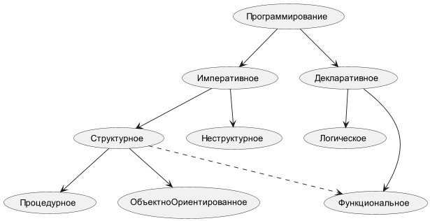

# Парадигмы программирования

<u>Парадигма</u> языков программирования - это совокупность правил, принципов и методик, используемых в процессе разработки ПО. От неё 
зависит стиль написания программы.

### Императивное программирование
Условно отвечает на вопрос КАК?  

Это парадигма, основанная на составлении алгоритма действий, которые изменяют состояние программы.  

Примеры языков: C, C++, Python, C#, Java, JavaScript, PHP

### Декларативное программирование 
Условно отвечает на вопрос ЧТО?  

Это парадигма, при которой описывается желаемый результат, без составления детального алгоритма его получения.  

Примеры языков: SQL, HTML, Prolog

### Неструктурное программирование 
Характерно для наиболее ранних языков программирования. При неструктурном программировании из любого места программы возможен переход к любой 
строке, т.е. допускается в явном виде команда Goto - оператор безусловного перехода - перенаправляет выполнение кода в какую-либо часть программы, 
помеченную меткой.

Примеры языков: ранние версии BASIC, Fortran

### Структурное программирование
Любой исполняемый алгоритм может быть преобразован к структурированному виду, когда ход его выполнения 
определяется только при помощи трёх структур управления: последовательной, ветвлений (условие) и циклов. 

Примеры языков: C, Pascal, Java

### Процедурное программирование
Программа разбивается на несколько процедур (подпрограмм). Процедура – именованная последовательность действий для 
решения некоторой подзадачи поставленной задачи. Выполнение программы сводится к последовательному выполнению инструкций с целью преобразования исходного состояния памяти, (значений исходных данных), в заключительное (в результаты).

Примеры языков: Basic, Фортран, Pascal

### Функциональное программирование
Основано на математическом понятии функции, которая не изменяет свое окружение. Функциональная программа 
состоит из совокупности определений функций, и дальнейшей последовательности вызовов этих функций. Каждая функция возвращает некоторое значение в 
вызвавшую его функцию. Программа создается под одну конкретную задачу, поэтому от нее ждут конкретный результат. В функциях прописывается, какую информацию она должна получить в качестве входящего значения, а какую должна отдать. Функции являются первоклассными значениями, поэтому они могут быть переданы в качестве аргументов другим функциям и возвращены как результаты вызовов функций.

Примеры языков: F#, Lisp, Haskell

### Ллогическое программирование
Программы выражены в виде формул математической логики (описание совокупности утверждений на формальном языке), и 
решение задачи достигается путем вывода логических следствий из них.

Примеры языков: Prolog

### Объектно-ориентированное программирование
Это методология программирования, основанная на представлении программы в виде совокупности взаимодействующих объектов, каждый из которых является 
экземпляром определённого класса, а классы образуют иерархию наследования.  

Задача программиста - реализовать такие объекты, при взаимодействии которых можно будет получать желаемый результат.

В основе ООП лежат такие понятия как **наследование, полиморфизм и инкапсуляция**.

<u>Инкапсуляция</u>. Малозначащие детали объекта скрыты. Объект, получая какую-либо команду, сам «знает» как ее обработать исходя 
из того, к какому классу он принадлежит. 

<u>Наследование</u>. Все объекты являются экземплярами классов, которые по отношению друг к другу могут выступать в роли родитель-потомок. Дочерние 
классы 
наследуют свойства родительского. 

<u>Полиморфизм</u>. В случае, когда 100% наследование не требуется, выручает полиморфизм, который предполагает переопределение методов 
родительского класса в дочерних классах.

Примеры языков: С++, C#, JAVA